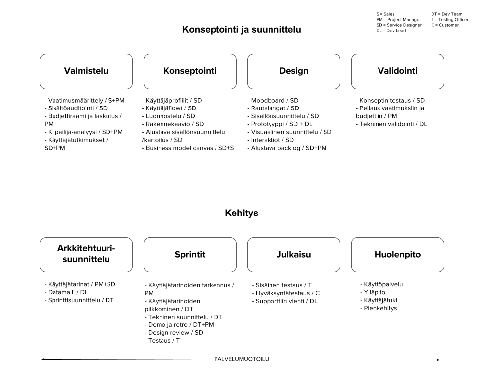

Tämä ohjesivusto on tarkoitettu Geniemin projektien ohjenuoraksi sekä asiakkaille dokumentaatioksi Geniem Oy:n sisäisesti kehitetystä projektimallista.

### Roolit

**Myyjä**

**Service Designer** toimii kuin projektin "ohjaajana". Hän vastaa asiakkaan kanssa konseptista, kehitettävän palvelun ilmeestä ja käytettävyydestä läpi projektin.

**Projektipäällikkö** on kuin projektin "tuottaja". Hän vastaa projektin käytännön asioista, että projektilla on budjetti, selkeyttää SD:n kanssa asiakkaan vaatimuksia ja käyttäjätarinoita, ja varmistaa, että kehitystiimillä on kaikki tarvittava projektin toteuttamiseen.

**Dev lead** vastaa projektin teknisestä arkkitehtuurista ja teknisestä laadusta.

**Kehittäjä**

**Testaaja**

### Termit

**QA** = Quality Assurance. Laadunvarmistus, käytännössä testaus.

**hyväksymiskriteerit** = käyttäjätarinan vaatimukset, jotka on täytettävä ja pystyttävä demoamaan, esimerkiksi “- kenttään voi syöttää ainoastaan numeroita”

**issue** = Jirassa oleva “tiketti”, joka voi olla esimerkiksi käyttäjätarina (user story), tehtävä (task) tai bugi (bug).

**käyttäjätarina** = yhdellä lauseella kuvattu järjestelmän toiminnallisuus, jonka myös asiakas ymmärtää (ei teknistä jargonia)

**sprintti** = kehityssykli, tietty määrää aikaa jonka kuluessa tehdään etukäteen valitut ja suunnitellut työt. Kesto melko poikkeuksetta 2 viikkoa.

**taski** = suoritettava työtehtävä, joka ei ole käyttäjätarina, esimerkiksi “Tuotantoympäristön konfigurointi”

### Materiaalit

#### Dokumenttipohjat

Kun projekti alkaa, kopioi [project flow kansio](https://drive.google.com/drive/u/0/folders/0B_OZw4sEmTtzRmJhc3M1UGEtdGM) Google Docsissa. Siirrä kansio hakemistoon /Projektit. Nimeä kansio projektin nimellä. Muokkaa tiedostojen nimien alkuun projektin nimi, esimerkiksi xxx_Käyttäjäpersoona -> ProjektinNimi_Käyttäjäpersoona.

#### Confluence-wiki ja checklistat

Luo projektille space Confluenceen kopioimalla [Projektipohja](https://geniem.atlassian.net/wiki/spaces/PROJA/overview) ja nimeä se projektin nimellä. Projektipohja sisältää myös [checklistat](https://geniem.atlassian.net/wiki/spaces/PROJA/pages/38043700/Checklistat).

