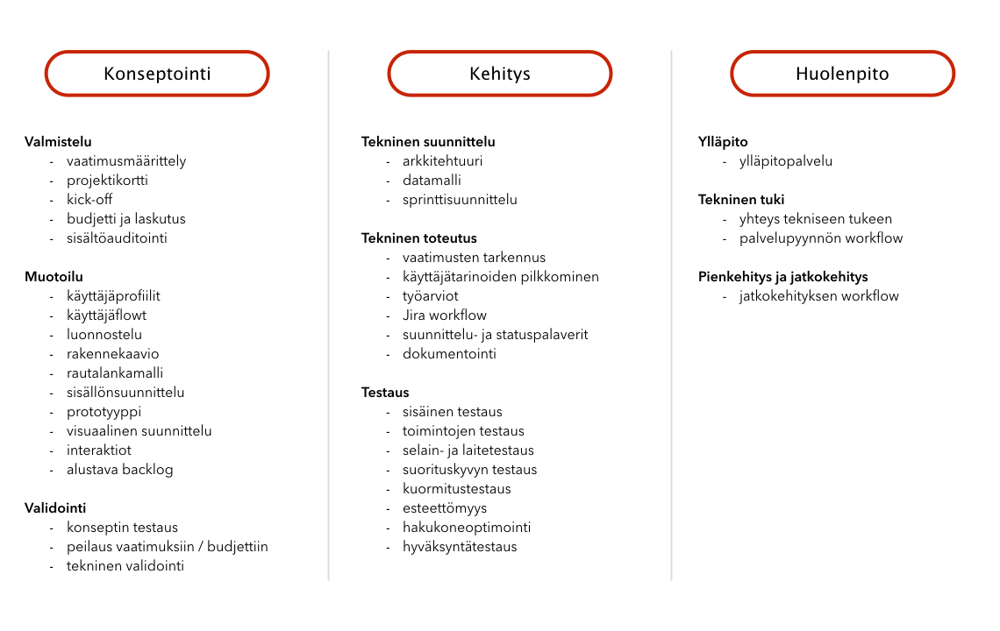

Tämä ohjesivusto on tarkoitettu Geniemin projektien ohjenuoraksi sekä asiakkaille tiedoksi Geniem Oy:n sisäisesti kehitetystä projektimallista.

## Roolit

**Myyjä** on asiakkaan ensimmäinen kontakti. Myyjä hoitaa projektin sopimuksen.

**Service Designer** toimii kuin projektin "ohjaajana". Hän vastaa asiakkaan kanssa konseptista, kehitettävän palvelun ilmeestä ja käytettävyydestä läpi projektin.

**Projektipäällikkö** on kuin projektin "tuottaja". Hän vastaa projektin käytännön asioista, kuten budjetista ja aikataulutuksesta. Projektipäällikkö selkeyttää service designerin kanssa asiakkaan vaatimuksia ja käyttäjätarinoita sekä varmistaa, että kehitystiimillä on kaikki tarvittava projektin toteuttamiseen.

**Dev Lead** vastaa projektin teknisestä arkkitehtuurista ja teknisestä laadusta.

**Kehittäjä** eli koodaaja vastaa teknisestä toteutuksesta.

**Testaaja** varmistaa laadun projektin aikana sekä ennen julkaisua. Testaaja vastaa laite- ja selaintestauksesta sekä toiminnallisuuksien testauksesta.

## Termit

**QA** = Quality Assurance. Laadunvarmistus, käytännössä testaus.

**hyväksymiskriteerit** = käyttäjätarinan vaatimukset, jotka on täytettävä ja pystyttävä demoamaan, esimerkiksi “- kenttään voi syöttää ainoastaan numeroita”

**issue** = Jirassa oleva “tiketti”, joka voi olla esimerkiksi käyttäjätarina (user story), tehtävä (task) tai bugi (bug).

**käyttäjätarina** = yhdellä lauseella kuvattu järjestelmän toiminnallisuus, jonka myös asiakas ymmärtää (ei teknistä jargonia)

**sprintti** = kehityssykli, tietty määrää aikaa jonka kuluessa tehdään etukäteen valitut ja suunnitellut työt. Kesto melko poikkeuksetta 2 viikkoa.

**taski** = suoritettava työtehtävä, joka ei ole käyttäjätarina, esimerkiksi “Tuotantoympäristön konfigurointi”

<!---
## Työvälineet
**Jira** on tehtävienhallintaan ja projektin seuraamiseen käytettävä työkalu. Kaikki projektin tehtävät ja käyttäjätarinat sijaitsevat Jirassa. Ne etenevät boardeiksi kutsutuissa näkymissä sitä mukaa, kun tehtävät edistyvät. Työtunnit logataan Jiraan.
**Confluence** on wikityökalu, joka sisältää pääasiallisesti projektien perustiedot ja sisäisiä ohjeita.
**Google Docs** sisältää kaiken projektikohtaisen materiaalin. 
**Slack** on väline tiimityöskentelyyn ja päivittäiseen kommunikaatioon. Jokaisella projektilla on oma kanavansa. Asiakkaat kutsutaan liittymään Geniemin Slack-tiimiin. Näin varmistetaan nopea ja selkeä kommunikaatio kehittäjien ja asiakkaan edustajien välillä. [Ohje Slackin käyttöön](https://get.slack.help/hc/en-us/categories/202622877-Slack-Guides)
-->

## Materiaalit

### Dokumenttipohjat

Kun projekti alkaa, kopioidaan [Project flow -kansio](https://drive.google.com/drive/u/0/folders/0B_OZw4sEmTtzRmJhc3M1UGEtdGM) Google Docsissa. Kansio siirretään hakemistoon /Projektit. Kansio nimetään projektin nimellä. Tiedostojen nimien alkuun muokataan projektin nimi, esimerkiksi xxx_Käyttäjäpersoona -> ProjektinNimi_Käyttäjäpersoona.

### Confluence-wiki

Projektille luodaan space Confluenceen kopioimalla [Projektipohja](https://geniem.atlassian.net/wiki/spaces/PROJA/overview) ja nimeämällä se projektin nimellä. 

